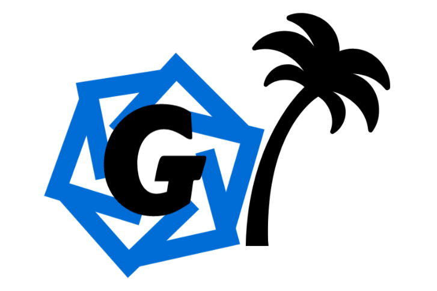

# Generators Jungle

* [Variational Autoencoder](vae.py)
* [Categorical Structural Agnostic Model](https://github.com/Didayolo/medi-chal/tree/master/code/generators)
* [Wasserstein GAN](https://github.com/yknot/mimic_improved_wgan)
* [Additive Noise Model](https://github.com/Didayolo/medi-chal/tree/master/code/generators)
* [medGAN](https://github.com/mp2893/medgan)
* [Copula](https://github.com/Didayolo/medi-chal/tree/master/code/generators)
* [Random Forest Imputations](https://github.com/Didayolo/medi-chal/tree/master/code/generators)
